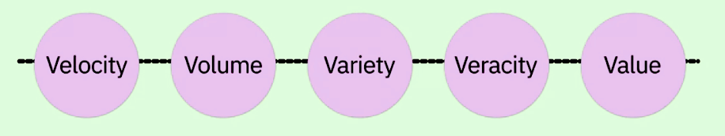

## Bit Data

Big Data refers to the dynamic, 
large and disparate volumes of data being created by people, tools, and machines

**The 5 V**

Data Scientists today derive insights from Big Data 
and cope with the challenges that these massive data sets present

The Big Data processing technologies provide ways to work with large sets of structured,
semi-structured, and unstructured data so that value can be derived from big data

Tools like
- Apache Hadoop: Hadoop is a collection of tools 
that provides distributed storage and processing of big data
- Apache Hive:  data warehouse for data query and analysis built on top of Hadoop
- Apache  Spark: distributed data analytics framework designed to perform complex data analytics in real-time

provide ways to extract, load, analyze, and process the data across 
distributed compute resources, providing new insights and knowledge

_Open source technologies:_
