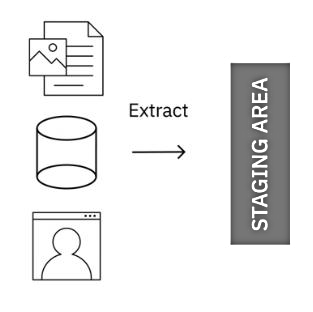
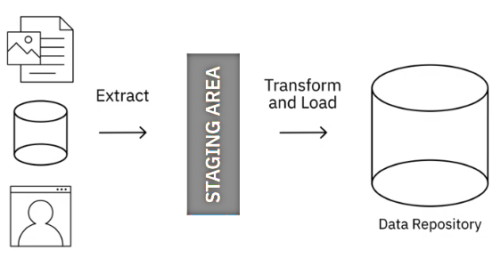

## ETL

**Extract** is the step where data from source locations is collected for transformation.

can be done with:

- batch processes: large chunks of data moved from source to destination at sheduled intervals

- stream processes: data pulled in real-time from sources transformed in transit and loaded
into the data repository

**Transform**  involves the execution of rules and functions 
that convert raw data into data that can be used for analysis.

- standardize data formats
- remove duplicated data
- filtering out data not required
- enriching data
- establishing key relationships between tables
- applyting business rules and data validations

Loading is the transportation of the processed data into a data repository.
- initial loading : populating all data into the repository
- incremental loading : applyting updates periodically
- full refresh: erasing data and reloading fresh data

it also includes:
- checks of null values
- server performance
- load failures

Some of the popular ETL tools available include

## ELT

In ELT process, extracted data is first loaded into the target system, and transformations are applied
in the target system.

- helps process large sets of unstructured data and non-relational data
- is ideal for data lakes
- the cycle between extraction and delivery is shorter
- allows to ingest volumes of raw data as the data becomes available
- greater flexibility for analysts and data scientists for EDA (Exploratory Data Analytics)
- trasform only the data that is required
- preferred choice when working with Big Data

## Data Pipeline

- Moving data from one system to another
- can be batch or streaming

