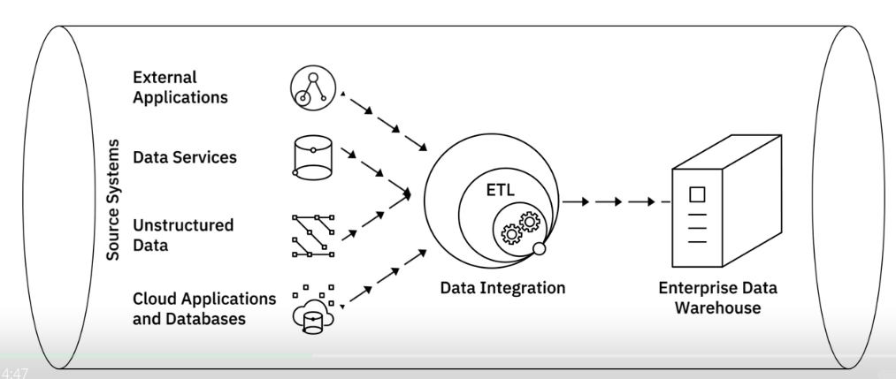
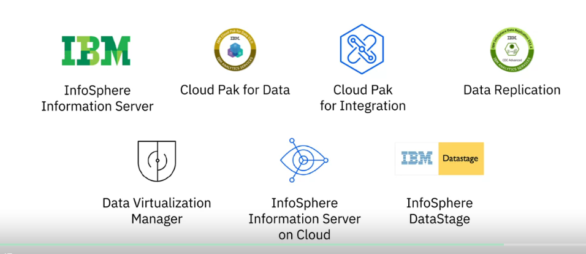
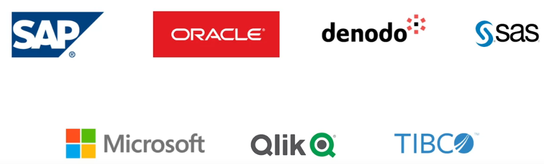
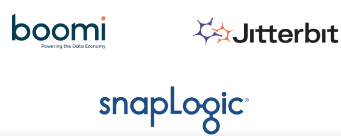
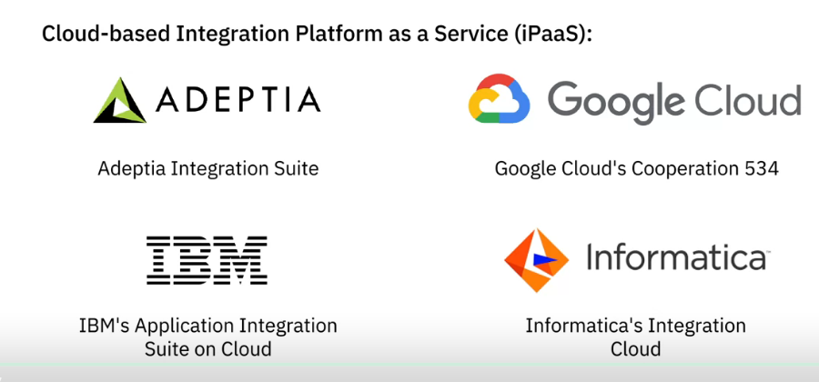

## ETL

**Extract** is the step where data from source locations is collected for transformation.

can be done with:

- batch processes: large chunks of data moved from source to destination at sheduled intervals

- stream processes: data pulled in real-time from sources transformed in transit and loaded
into the data repository

**Transform**  involves the execution of rules and functions 
that convert raw data into data that can be used for analysis.

- standardize data formats
- remove duplicated data
- filtering out data not required
- enriching data
- establishing key relationships between tables
- applyting business rules and data validations

Loading is the transportation of the processed data into a data repository.
- initial loading : populating all data into the repository
- incremental loading : applyting updates periodically
- full refresh: erasing data and reloading fresh data

it also includes:
- checks of null values
- server performance
- load failures

Some of the popular ETL tools available include

## ELT

In ELT process, extracted data is first loaded into the target system, and transformations are applied
in the target system.

- helps process large sets of unstructured data and non-relational data
- is ideal for data lakes
- the cycle between extraction and delivery is shorter
- allows to ingest volumes of raw data as the data becomes available
- greater flexibility for analysts and data scientists for EDA (Exploratory Data Analytics)
- trasform only the data that is required
- preferred choice when working with Big Data

## Data Pipeline

- Moving data from one system to another
- can be batch or streaming

## Data Integration

Data integration as a discipline that involved 
- the practices, architectural techniques, tools that allow organizations to 
  - ingest
  - transform
  - combine
  - provision 
  
data across various data types

- Data consistency across applications
- Master data management
- Data sharing between enterprises
- Data migration and consolidation

Data integration includes:

- accessing, queueing, or extracting data from operational systems 
- transforming and merging extracted data either logically or physically 
- data quality and governance
- delivering data through an integrated approach for analytics purposes

 - Data integration combines disparate data into a unified view of the data, 
 - Data pipeline covers the entire data movement journey from source to destination systems

Capabilities of a modern data integration:

- Pre-built connectors and adopters that help you connect and build 
integration flows with a wide variety of data sources such as databases, flat files, social media data, APIs, CRM and ERP applications. 

- Open-source architecture that provides greater flexibility
- Optimization for both batch processing of large-scale data and continuous data streams, or both. 

- Integration with Big Data sources.
- Functionalities for data governance, compliance, security
- Portability between differennt cloud environments

**Data Integration Tools:**

---

**Talend Integration Tools:**

- Talend Data Fabric
- Talend Cloud
- Talend Data Catalog
- Talend Data Management
- Talend Big Data
- Talend Data Services
- Talend Open Studio

---
**Other vendors of data integrations**

---

**Open source tools**

---

**Platform as a Service (PaaS)**
