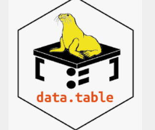

## Data Wrangling

Data wrangling, also known as data munging, is an iterative process that involves 
data exploration, transformation, 
validation, and making data available for a credible and meaningful analysis

- **Structuring**: change the form and schema of your data.
 - **Normalization** and **denormalization** of data: normalization focuses on leaning the database of unused data and reducing redundancy and inconsistency
 - **Cleaning**: fix irregularities in data in order to produce a credible and accurate analysis.

## **Tools for Data Wrangling**
**Excel Power Query** / Spreadsheets  

built formulae that can help you identify issues, clean, and transform data
  - Microsoft Power Query for **Excel** 
  - Google Sheets Query function for **Google Sheets**

---

**OpenRefine** 

Open source tool to import andexport data in a wide variety of formats,
such as TSV, CSV, XLS, XML, and JSON 

---

**Google DataPrep**  

an intelligent cloud data service that allows you to visually explore, clean, 
and prepare both structured and unstructured data for analysis. 
It is a fully managed service.

---

**Watson Studio Refinery** 

available via IBM Watson Studio or Cloud Pak for Data, allows you to discover, 
cleanse, and transform data with built-in operations. 
It transforms large amounts of raw data into consumable, quality information that’s ready for analytics

---

**Trifacta Wrangler**

is an interactive cloud-based service for cleaning and transforming data. 
It takes messy, real-world data and cleans and rearranges it into data tables, 
which can then be exported to Excel, Tableau, and R

---

**Python** 

 has a huge library and set of packages that offer powerful data manipulation capabilities.
Let’s look at a few of these libraries and packages.

**Jupiter Notebook**

an open-source web application widely used for data cleaning and transformation, 
statistical modeling, also data visualization

 **NumPy**
 

Numerical Python, is the most basic package that Python offers, mathematical functions to operate on arrays.

**Pandas**

designed for fast and easy data analysis operations. It allows complex operations such as merging, joining, 
and transforming huge chunks of data, performed using simple, single-line commands

----

**R** 

 offers a series of libraries and packages that are explicitly 
 created for wrangling messy data.
 Using these libraries, you can investigate, manipulate, and analyze data.
Libraries:

- **Dplyr**: a powerful library for data wrangling. It has a precise and straightforward syntax

- **R Data.table**: helps to aggregate large data sets quickly

- R **Jsonlite**: is a robust JSON parsing tool, great for interacting with web APIs

 