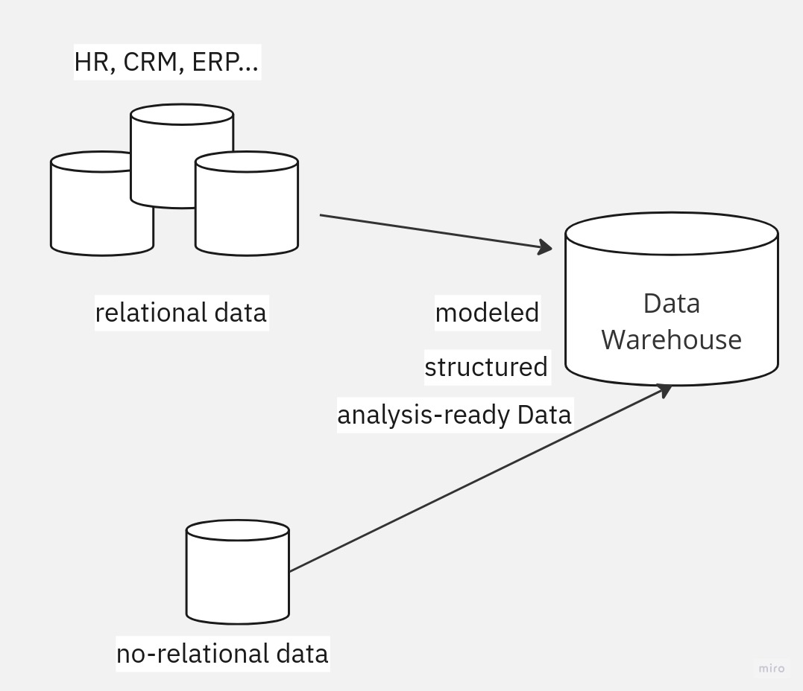
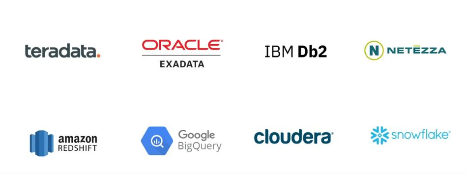
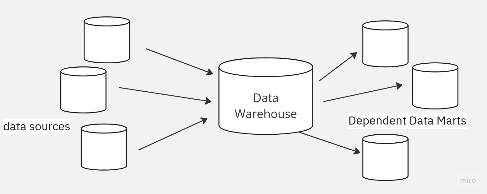
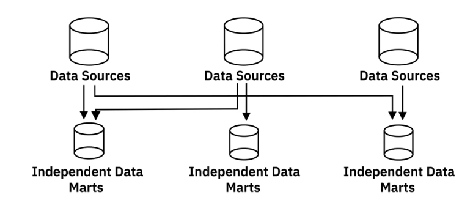
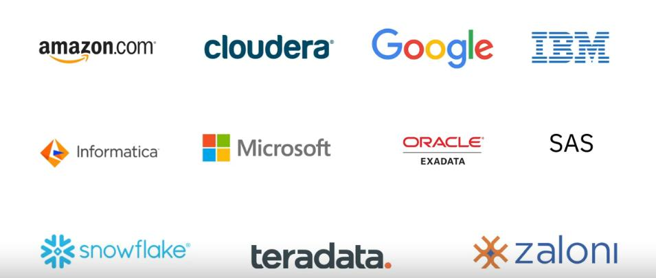

# Data mining

All data mining repositories have a similar goal, which is to 
- house data for reporting
- analysis
- and deriving insights

### Data Warehouse 

A data warehouse is a central repository of data integrated from multiple sources. 

Data warehouses serve as the single source of truth
- storing current and historical data that has been 
  - cleansed
  - conformed
  - categorized

When data gets loaded into the data warehouse, 
it is already modeled and structured for a specific purpose, meaning it's analysis-ready.

A Data Warehouse has a 3-tier architecture

- Database Servers
- OLAP Servers 
- Client front-end layer (querying, reporting, analyzing)

Data Warehouse on the Cloud:

---

### Data Marts

It is a sub-section of the data warehouse, built specifically for a particular business
function. 
Purposes:
- provide data to users that is most relevant to them when they need it
- accellerate business processes
- provide cost and time efficient data-driven decisios
- improve end-user response time
- provide secure access and control
 

There are three types of Data Marts:
- Dependent: offers analytical capabilities for a restricted area of a Data Warehouse
Pull data from an enterprise Data Warehouse were data has already been cleaned and transformed.

- Independent: are created from sources other than Enterprise Data Warehouse
such as Internal Operational Systems or External Data
Need to carry out the transformation process on the source data
 since it is coming directly from operational systems and external sources.

- 
- Hybrid: combine inputs from Data Warehouse, 
Operational Systems and External Systems.

---

### Data Lakes

Is a Data repository that can store large amounts of
structured, semi-structured and unstructured data in a native format.

 Data can be loaded without defining the structure and schemas
 
It is a repository of raw data from source, that can be transformed
based on the use cases.

Can be deployed using:
- Cloud Object storage like Amazon S3
- Large-scale distributed systems like Apache Hadoop
- Relational DBMS as well NoSQL data repositories

- Ability to store all types of data
- Agility to scale based on storage capacity
- Saving time in defining structures, schemas and transformations

