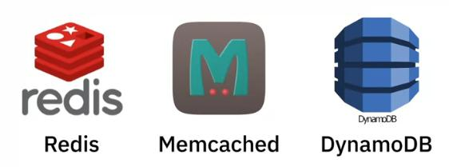
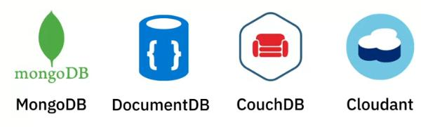

# Not Only SQL Databases

#### Provide flexible schemas for the storage and retrieval of data.

_Gained popularity due to the emergence of cloud computing, 
they are  high scalable, do not typically uses the SQL_ 

Data can be store in a schema-less structure.

Advantages:
- Ability to handle large volumes of 
- structured, semi-structured, unstructured data

- Ability to run as a distributed scaled accross multiple data centers

- An efficient and cost-effective scale-out architecture that provides additional
capacity and performance with the addition of new nodes.

- Simpler design, better control over availability, 
improved scalabiity that makes it agile, flexible and support quick iterations

### **Key-values store**

Collection of key-value pairs.

A key represent an attribute of the data and is a unique identifier.

Both Keys and Values can be anything (integer or Json) .

Great for 
- storing user session data, 
- user preferences
- real-time recommendations
- target advertising
- in-memory data caching

 _Not a great fit if you want to_
 - query data on specific data value
 - need relationships between data value
 - need multiple unique values

 
 

---

### **Document based** 

Store each record and its associated data within a single document.

Enable flexible indexing, ad hoc queries, analytics over collections of documents.

Preferred for 
- eCommerce platforms, 
- medical records,
- CRM platforms
- Analytics platforms

_Not a great fit if you want to:_
- Run complex search queries
- Perform multi-operation transactions

 
` 
### **Document based** 

Data is stored in cells, grouped as columns of data (instead of rows).

A logical grouping of columns is referred to as a column family.

All cells corresponding to a columns are saved a continuous disk entry, 
making access and search easier and faster.

Great for systems that 
- require heavy write requests
- storing time-series data
- weather data
- IoT data.

_Not a great fit if you want to :_
- run complex queries
- change querying patterns frequently

---

### **Graph based** 

Use a graphical model to represent and store data

Useful for visualizing, analyzing and finding connections between different pieces of data.

An excellent choice for working with connected data.

- Social networks
- Product recommendations
- Network diagrams
- Fraud detection
- Access management

Not a great fit if you want to
- process high volumes of transactions

