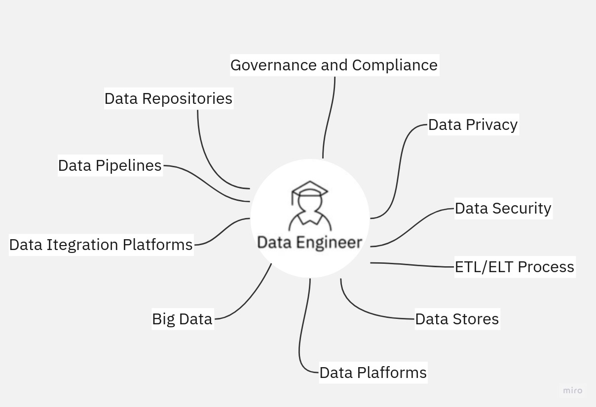

# Data Engineering

Data Engineers work within the data ecosystem to 
- extract
- integrate
- organize data from disparate sources; 

---
- clean
- transform
- prepare data; 
----
- design
- store
- manage data in data repositories.

---

The field of **Data Engineering** concerns itself with the tasks of collecting source data includes extracting, integrating, and organizing data from disparate sources. 
 At a broad level, Data Engineers:
- Extract, organize, and integrate data from disparate sources
- Prepare data for analysis and reporting by transforming and cleansing it
- Design and manage data pipelines that encompass the journey of data from source to destination systems, 
- Setup and manage the infrastructure required for the ingestion, processing, and storage of data.

its goal is to make quality 
data available for fact-finding and data-driven decision-making.

---
See the related Readme files:

## **[Relational DB](Relational_db%2FREADME.md)**

## **[Data Mining](Data_mining%2FREADME.md)**

## **[Data Pipeline](Data_Pipelines%2FREADME.md)**

## **[No Relational DB](No_Relational_db%2FREADME.md)**

## **[Big Data](Big_Data%2FREADME.md)**

## **[Data Wrangling](Data_Wrangling%2FREADME.md)**