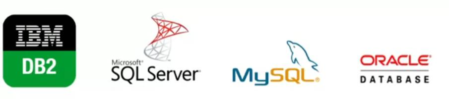
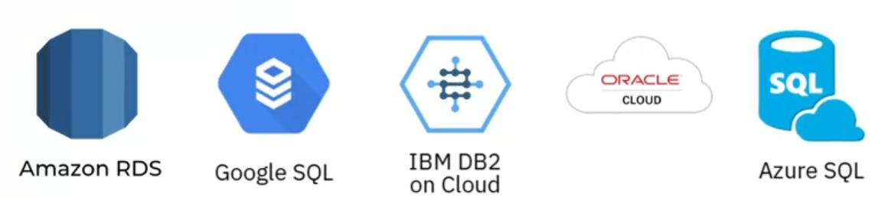

Relational Database:
- Ideal for optimized storage, retrieval and processing of data for large volumes
- Each table has a unique set of rows and columns
- Relationships can be defined between tables
- Fields can be restricted to specific data types and values
- Can retrieve millions of records in seconds using SQL
- Security architecture provides greater access control and governance

Relational DB can be open-source with internalor commercial support, or commercial closed-source.

## Some Relational Databases:

## Some Cloud-based Relational Databases
(Database-as-a-Service)

Advantages:
- create meaningful information
- Flexibility to make changes with the database in use
- Minimize data redundancy by allowing data relationships
- Offer export and import options to ease the backup
- ACIC compliant, ensuring database transactions
